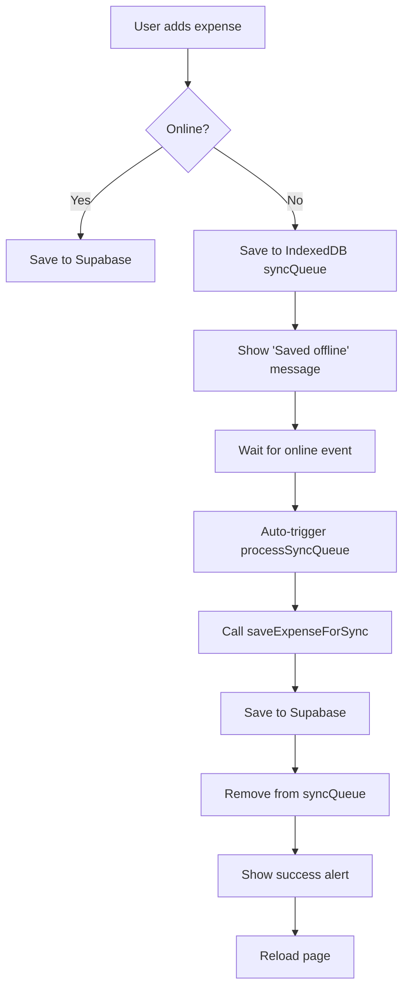

# AI Expense Tracker - Product Documentation

## Overview

An AI-powered Progressive Web App (PWA) for tracking personal expenses with offline support, voice input, and automatic Supabase synchronization.

## Tech Stack

### Frontend
- **Framework**: Next.js 14 (App Router)
- **Language**: TypeScript
- **Styling**: Tailwind CSS
- **State Management**: React Hooks
- **PWA**: next-pwa with Workbox

### Backend & Services
- **Database**: Supabase (PostgreSQL)
- **Authentication**: Supabase Auth
- **AI**: Groq (Llama 3.1 70B) for natural language expense parsing
- **Voice**: Web Speech API (browser native)

### Offline Support
- **Local Storage**: Dexie.js (IndexedDB wrapper)
- **Service Worker**: Workbox (via next-pwa)
- **Sync Strategy**: Queue-based background sync

### Monorepo
- **Tool**: Turborepo
- **Package Manager**: pnpm
- **Packages**:
  - `@repo/web` - Next.js application
  - `@repo/ui` - Shared UI components
  - `@repo/db` - Supabase client utilities
  - `@repo/ai` - Groq AI integration

## Core Features

### 1. Expense Management
- **Add Expenses**: Natural language input or manual form
- **Edit Expenses**: Modify existing entries
- **Delete Expenses**: Remove unwanted entries
- **View Dashboard**: See total expenses and category breakdown

### 2. AI-Powered Input
- **Natural Language Parsing**: "Spent 150 on coffee at Starbucks"
- **Voice Input**: Speech-to-text for hands-free entry
- **Auto-extraction**: Amount, category, merchant, date, time

### 3. Offline Functionality
- **Add Offline**: Save expenses to local IndexedDB when offline
- **Sync Queue**: Automatic background sync when connection restored
- **Pending Indicator**: Visual feedback for unsynced items
- **Manual Sync**: "Sync Now" button for on-demand synchronization

### 4. PWA Features
- **Installable**: Add to home screen on mobile/desktop
- **Offline Pages**: Custom offline fallback page
- **Service Worker**: Asset caching for fast loads
- **Manifest**: App icons and metadata

## Architecture

### Database Schema

```sql
-- Profiles (extends Supabase auth.users)
CREATE TABLE profiles (
  id UUID PRIMARY KEY REFERENCES auth.users,
  email TEXT,
  created_at TIMESTAMPTZ DEFAULT NOW()
);

-- Expenses
CREATE TABLE expenses (
  id UUID PRIMARY KEY DEFAULT gen_random_uuid(),
  user_id UUID REFERENCES profiles(id),
  amount DECIMAL(10,2) NOT NULL,
  currency TEXT DEFAULT 'INR',
  category TEXT NOT NULL,
  description TEXT NOT NULL,
  merchant TEXT,
  date DATE NOT NULL,
  time TIME,
  is_synced BOOLEAN DEFAULT true,
  created_at TIMESTAMPTZ DEFAULT NOW(),
  updated_at TIMESTAMPTZ DEFAULT NOW()
);
```

### Offline Sync Flow



### Key Files

#### Offline Support
- `apps/web/lib/offline/db.ts` - Dexie database schema
- `apps/web/lib/offline/sync.ts` - Sync queue logic
- `apps/web/components/OfflineSyncProvider.tsx` - Global sync orchestration
- `apps/web/app/components/PendingExpenses.tsx` - Pending items UI

#### Server Actions
- `apps/web/app/actions/expense.ts` - Expense CRUD operations
  - `saveExpenseAction()` - For online form submissions (with redirect)
  - `saveExpenseForSync()` - For background sync (no redirect)

#### PWA Configuration
- `apps/web/next.config.mjs` - next-pwa configuration
- `apps/web/public/sw.js` - Generated service worker
- `apps/web/app/offline/page.tsx` - Offline fallback page

## User Flows

### Adding an Expense (Online)
1. User clicks "+" button
2. Enters expense via text or voice
3. Clicks "Magic Parse" (AI extracts details)
4. Reviews/edits parsed data
5. Clicks "Save Expense"
6. Redirected to dashboard with new expense

### Adding an Expense (Offline)
1. User clicks "+" button (loads from cache)
2. Enters expense details
3. Clicks "Save Expense"
4. Saved to IndexedDB syncQueue
5. Alert: "You are offline. Expense saved locally..."
6. Yellow "Pending Sync" banner appears on dashboard
7. When online: Auto-sync triggers
8. Alert: "✅ Successfully synced 1 expense(s)!"
9. Page reloads, expense appears in list

### Manual Sync
1. User sees "Pending Sync: X expenses waiting"
2. Clicks "Sync Now" button
3. Sync process runs
4. Success/failure alert shown
5. Page reloads on success

## Configuration

### Environment Variables
```bash
# Supabase
NEXT_PUBLIC_SUPABASE_URL=https://xxx.supabase.co
NEXT_PUBLIC_SUPABASE_ANON_KEY=xxx

# Groq AI
GROQ_API_KEY=gsk_xxx

# App
NEXT_PUBLIC_APP_URL=http://localhost:3000
```

### PWA Settings
```javascript
// next.config.mjs
withPWA({
  dest: 'public',
  register: true,
  skipWaiting: true,
  disable: false, // Enable in dev for testing
  fallbacks: {
    document: '/offline',
  },
})
```

## Deployment

### Vercel (Recommended)
1. Push code to GitHub
2. Import project in Vercel
3. Set root directory: `apps/web`
4. Add environment variables
5. Deploy

### Build Commands
```bash
# Development
pnpm dev

# Production build
pnpm build

# Production server
pnpm start
```

## Known Limitations

### Development Mode
- **Offline navigation**: Shows browser error instead of `/offline` page
- **Service worker**: Limited caching in dev mode
- **Testing**: Use production build (`npm run build && npm run start`)

### Production
- **Dashboard offline**: Shows browser error on refresh (Server Component limitation)
- **Auth tokens**: May expire while offline, requiring re-login
- **First load**: Requires network for initial data fetch

## Future Enhancements

### Planned Features
- [ ] Receipt photo upload
- [ ] Budget tracking and alerts
- [ ] Expense categories management
- [ ] Export to CSV/PDF
- [ ] Multi-currency support
- [ ] Recurring expenses
- [ ] Analytics and insights

### Technical Improvements
- [ ] Convert dashboard to Client Component for full offline support
- [ ] Implement conflict resolution for concurrent edits
- [ ] Add retry logic with exponential backoff
- [ ] Optimize service worker caching strategies
- [ ] Add end-to-end tests for offline flows

## Troubleshooting

### Service Worker Not Registering
- Check DevTools → Application → Service Workers
- Ensure production build (`npm run build`)
- Clear cache and hard reload (Cmd+Shift+R)

### Sync Not Working
- Check browser console for errors
- Verify IndexedDB has items in `syncQueue`
- Try manual sync with "Sync Now" button
- Check network connectivity

### Offline Navigation Fails
- Expected in dev mode - use production build
- Ensure service worker is registered
- Check that `/offline` page exists

## Support & Resources

- **Supabase Docs**: https://supabase.com/docs
- **Next.js PWA**: https://github.com/shadowwalker/next-pwa
- **Dexie.js**: https://dexie.org
- **Groq AI**: https://console.groq.com
